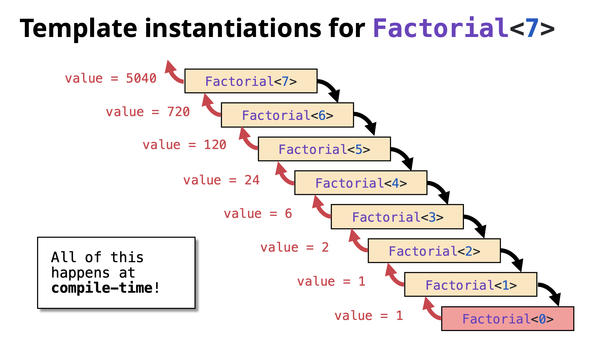

# Template Metaprogramming (TMP)

## Table of Contents
1. [From Variadic Templates to Template Metaprogramming](#from-variadic-templates-to-template-metaprogramming)
2. [Introducing Template Metaprogramming (TMP)](#introducing-template-metaprogramming-tmp)
(#compile-time-computation-factorial-example)
   - [Traditional Runtime Factorial](#traditional-runtime-factorial)
   - [Template Metaprogramming Factorial](#template-metaprogramming-factorial)
   - [Understanding the Recursion](#understanding-the-recursion)
   - [Verification: Compile-Time vs Runtime](#verification-compile-time-vs-runtime)
3. [More TMP Examples](#more-tmp-examples)
   - [Compile-Time Power Calculation](#compile-time-power-calculation)
   - [Compile-Time Fibonacci](#compile-time-fibonacci)
4. [TMP is Turing Complete](#tmp-is-turing-complete)
5. [Benefits and Drawbacks](#benefits-and-drawbacks)
6. [Best Practices](#best-practices)

---

## From Variadic Templates to Template Metaprogramming

We've learned that with **variadic templates**:
- The compiler generates any number of overloads using recursion
- This allows us to support any number of function parameters
- Instantiation happens at **compile time**

This leads us to an important question...

### Templates Work at Compile Time

Since templates are instantiated during compilation, all the work of generating different versions of functions and classes happens before the program even runs.

**Key Observation:** The compiler is doing work for us at compile time!

### Can We Use This to Our Advantage?

If templates do work at compile time, can we leverage this to:
- Perform calculations during compilation?
- Generate optimized code automatically?
- Move computations from runtime to compile time?

**The answer is YES!** This is exactly what **Template Metaprogramming** allows us to do.

[↑ Back to Table of Contents](#table-of-contents)

---

## Introducing Template Metaprogramming (TMP)

**Template Metaprogramming** is a technique where we use C++ templates to perform computations and make decisions at **compile time** instead of runtime.

Instead of computing values when the program runs, we compute them when the program is being compiled. The results are then embedded directly into the executable.

**Template Metaprogramming** is:
- A technique for performing computations at compile time using C++ templates
- Based on template recursion and specialization
- A form of functional programming within C++'s type system
- A way to generate optimized code automatically

**Core Principles:**
1. Use templates to represent computations
2. Use recursion for iteration
3. Use template specialization for base cases
4. Store results in enum or static const values

### Compile-Time Computation: Factorial Example

Let's see a concrete example of moving computation from runtime to compile time.

#### Traditional Runtime Factorial

```cpp
#include <iostream>

// Runtime factorial - computation happens when program runs
int factorial(int n) {
    if (n == 0) return 1;
    return n * factorial(n - 1);
}

int main() {
    std::cout << factorial(7) << std::endl;  // Computed at runtime
    return 0;
}
```

**Output:** `5040`

**What happens:** Every time you run this program, the CPU calculates 7! = 5040.

---

#### Template Metaprogramming Factorial

Now let's do the same computation at **compile time**:

```cpp
#include <iostream>

// Recursive case: Factorial<N> = N * Factorial<N-1>
template <size_t N>
struct Factorial {
    enum { value = N * Factorial<N - 1>::value };
};

// Base case: Factorial<0> = 1
// This is a template specialization for N=0
template <>
struct Factorial<0> {
    enum { value = 1 };
};

int main() {
    std::cout << Factorial<7>::value << std::endl;  // Computed at compile time!
    return 0;
}
```

**Output:** `5040`

**What happens:** The compiler calculates 7! = 5040 during compilation. The value `5040` is directly embedded in the executable. Zero runtime computation!

**Key Components:**

1. **Recursive case**: `template <size_t N> struct Factorial`
   - Defines the general rule: N! = N × (N-1)!
   - Uses `enum` to store compile-time constant

2. **Base case**: `template <> struct Factorial<0>`
   - This is a template specialization for N=0
   - Defines 0! = 1
   - Stops the recursion

3. **Compile-time recursion**: The compiler recursively instantiates templates until it hits the base case

---

### Understanding the Recursion

Let's trace how `Factorial<7>::value` is computed at compile time:

```
Factorial<7>::value = 7 * Factorial<6>::value
                    = 7 * (6 * Factorial<5>::value)
                    = 7 * (6 * (5 * Factorial<4>::value))
                    = 7 * (6 * (5 * (4 * Factorial<3>::value)))
                    = 7 * (6 * (5 * (4 * (3 * Factorial<2>::value))))
                    = 7 * (6 * (5 * (4 * (3 * (2 * Factorial<1>::value)))))
                    = 7 * (6 * (5 * (4 * (3 * (2 * (1 * Factorial<0>::value))))))
                    = 7 * (6 * (5 * (4 * (3 * (2 * (1 * 1))))))  ← Base case hit!
                    = 5040
```

**Important:** This entire calculation happens during compilation, not when the program runs!


---

### Verification: Compile-Time vs Runtime

You can verify that the computation happens at compile time by looking at the assembly code:

```cpp
// Runtime version
int result = factorial(7);  
// Generates function call instructions

// Compile-time version  
int result = Factorial<7>::value;  
// Becomes: int result = 5040;
// No function call, just a constant!
```

[↑ Back to Table of Contents](#table-of-contents)

---

## More TMP Examples

### Compile-Time Power Calculation

Calculate X^N at compile time:

```cpp
#include <iostream>

// Recursive case: Power<X, N> = X * Power<X, N-1>
template <size_t X, size_t N>
struct Power {
    enum { value = X * Power<X, N - 1>::value };
};

// Base case: Power<X, 0> = 1
template <size_t X>
struct Power<X, 0> {
    enum { value = 1 };
};

int main() {
    std::cout << "2^10 = " << Power<2, 10>::value << std::endl;
    std::cout << "3^5 = " << Power<3, 5>::value << std::endl;
    std::cout << "5^4 = " << Power<5, 4>::value << std::endl;
    return 0;
}
```

**Output:**
```
2^10 = 1024
3^5 = 243
5^4 = 625
```

All calculated at compile time!

---

### Compile-Time Fibonacci

Calculate Fibonacci numbers at compile time:

```cpp
#include <iostream>

// Recursive case: Fib<N> = Fib<N-1> + Fib<N-2>
template <size_t N>
struct Fibonacci {
    enum { value = Fibonacci<N - 1>::value + Fibonacci<N - 2>::value };
};

// Base cases
template <>
struct Fibonacci<0> {
    enum { value = 0 };
};

template <>
struct Fibonacci<1> {
    enum { value = 1 };
};

int main() {
    std::cout << "Fib(0) = " << Fibonacci<0>::value << std::endl;
    std::cout << "Fib(1) = " << Fibonacci<1>::value << std::endl;
    std::cout << "Fib(10) = " << Fibonacci<10>::value << std::endl;
    std::cout << "Fib(20) = " << Fibonacci<20>::value << std::endl;
    return 0;
}
```

**Output:**
```
Fib(0) = 0
Fib(1) = 1
Fib(10) = 55
Fib(20) = 6765
```

[↑ Back to Table of Contents](#table-of-contents)

---

## TMP is Turing Complete

Template Metaprogramming in C++ is **Turing complete**, meaning it can theoretically compute anything that any other programming language can compute (given enough compile time and memory).

This was accidentally discovered and not originally intended! It means you can:
- Perform any calculation at compile time
- Implement any algorithm using templates
- Make complex compile-time decisions

**Examples of what's possible:**
- Compile-time sorting
- Compile-time prime number generation
- Compile-time parsers
- Complex type manipulations
- Compile-time unit conversions

However, just because you can doesn't always mean you should. TMP should be used judiciously where it provides real benefits.

[↑ Back to Table of Contents](#table-of-contents)

---

## Benefits and Drawbacks

### Benefits

1. **Zero Runtime Cost**: Computations are done during compilation
2. **Performance**: Results are embedded as constants in the executable
3. **Type Safety**: Errors caught at compile time
4. **Optimization**: Compiler can optimize better with known constant values
5. **Code Generation**: Generate specialized code automatically

### Drawbacks

1. **Compilation Time**: Can significantly increase compile times
2. **Complexity**: Code is harder to read and debug
3. **Error Messages**: Compiler errors can be cryptic and long
4. **Limited Debugging**: Can't debug compile-time code easily
5. **Compiler Limits**: Recursion depth limits may be hit

[↑ Back to Table of Contents](#table-of-contents)

---

## Best Practices

1. **Use TMP when it provides clear benefits**: Don't use it just because you can
2. **Prefer `constexpr` for modern C++**: C++11's `constexpr` is often simpler and clearer(Will be covered in detail in a separate chatpter)
3. **Document well**: TMP code needs good comments
4. **Keep it simple**: Complex TMP can be unmaintainable
5. **Consider compile time**: Balance compile-time vs runtime performance
6. **Use static_assert**: Validate template parameters at compile time

**Modern Alternative with constexpr:**

```cpp
// Modern C++11+ approach
constexpr size_t factorial(size_t n) {
    return (n == 0) ? 1 : n * factorial(n - 1);
}

int main() {
    constexpr size_t result = factorial(7);  // Computed at compile time
    std::cout << result << std::endl;
    return 0;
}
```

This achieves the same result with much cleaner syntax!
Will be covered in detail in separate chapter.

[↑ Back to Table of Contents](#table-of-contents)

---
