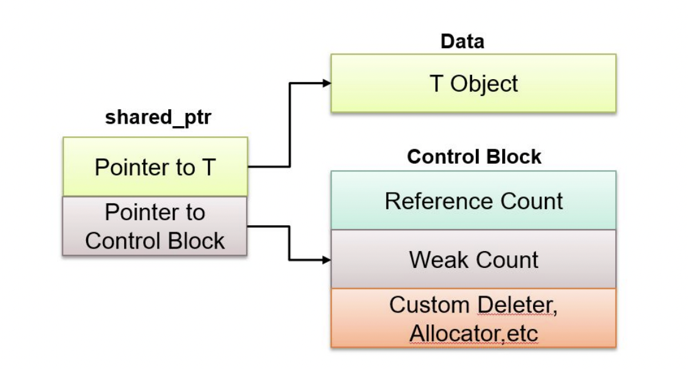
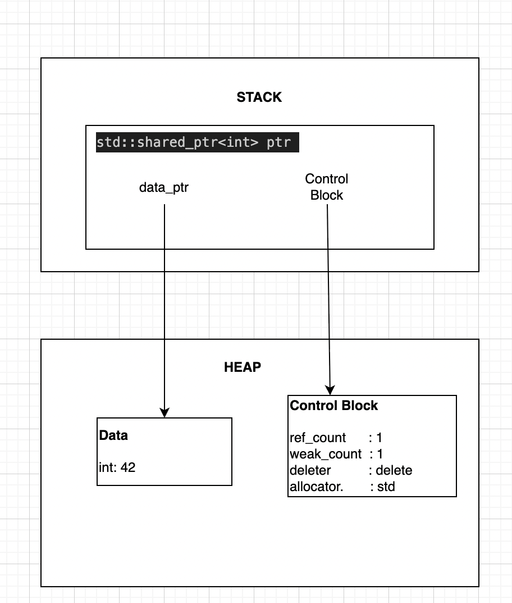
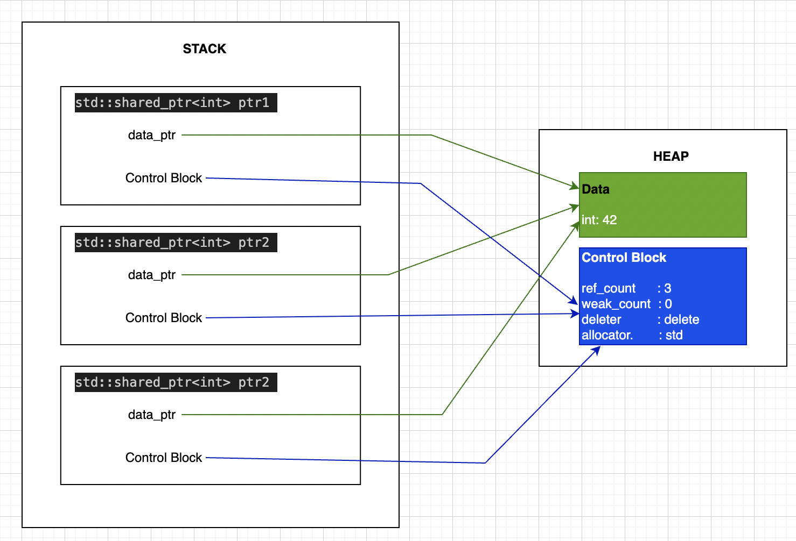

# std::shared_ptr<T>: Shared Ownership of Resources
---

When working with `unique_ptr<T>`, you have exclusive ownership - only one pointer can own a resource at a time. But what if multiple parts of your program legitimately need to own the same resource? What if you have a design where several objects should collectively manage a resource's lifetime?

This is where `std::shared_ptr<T>` comes in. Unlike `unique_ptr<T>`, which enforces exclusive ownership, `shared_ptr<T>` allows **multiple owners to share responsibility** for a single resource. The resource is automatically cleaned up only when the **last owner is destroyed**.

---

## What is std::shared_ptr<T>?

`std::shared_ptr<T>` is a smart pointer that manages a resource through **shared ownership**. Multiple `shared_ptr` instances can point to the same resource and collectively manage its lifetime through a reference counting mechanism.

`std::shared_ptr<T>` consists of two main components: a **data pointer** and a **control block pointer**.



### Key Characteristics

- **Shared Ownership**: Multiple `shared_ptr` can own the same resource
- **Reference Counting**: Internally maintains a count of how many `shared_ptr` instances own the resource
- **Automatic Cleanup**: Resource is deleted only when the last owner is destroyed
- **Copyable**: Unlike `unique_ptr`, you can freely copy a `shared_ptr`
- **Movable**: You can also move a `shared_ptr` to transfer ownership
- **Reference Counted Overhead**: Slightly slower than `unique_ptr` due to atomic reference counting

### How Reference Counting Works

Each resource managed by `shared_ptr` has an associated **reference count**:

1. **When created**: Count = 1 (one owner)
2. **When copied**: Count increments (more owners)
3. **When destroyed**: Count decrements
4. **When count reaches 0**: Resource is automatically deleted

```cpp
std::shared_ptr<int> ptr1 = std::make_shared<int>(42);  // count = 1

std::shared_ptr<int> ptr2 = ptr1;  // count = 2

std::shared_ptr<int> ptr3 = ptr1;  // count = 3

// ptr1 goes out of scope    // count = 2
// ptr3 goes out of scope    // count = 1
// ptr2 goes out of scope    // count = 0 -> Memory is deleted
```

---

### Single shared_ptr

When you create: `std::shared_ptr<int> ptr = std::make_shared<int>(42);`




### Three shared_ptr Sharing Same Resource

When you do:
```cpp
std::shared_ptr<int> ptr1 = std::make_shared<int>(42);
std::shared_ptr<int> ptr2 = ptr1;  // Copy
std::shared_ptr<int> ptr3 = ptr1;  // Copy
```             



**Key Point**: All 3 shared_ptr point to the SAME Control Block!
- When ANY one is copied, ref_count increments
- When ANY one is destroyed, ref_count decrements

---

## Creating a shared_ptr

### Method 1: Using `std::make_shared<T>` (Recommended)

`std::make_shared<T>` is the **preferred way** to create a `shared_ptr`. It allocates the object and the reference count metadata in a single operation, making it more efficient. (See the detailed comparison with `new` in the "Advanced Topics" section at the end.)

```cpp
#include <memory>
#include <iostream>

class Logger {
public:
    Logger(const std::string& name) : name_(name) {
        std::cout << "Logger '" << name_ << "' created\n";
    }
    ~Logger() {
        std::cout << "Logger '" << name_ << "' destroyed\n";
    }
    void log(const std::string& msg) const {
        std::cout << "[" << name_ << "] " << msg << "\n";
    }
private:
    std::string name_;
};

int main() {
    // Create using make_shared - THIS IS PREFERRED
    std::shared_ptr<Logger> logger1 = std::make_shared<Logger>("Main");
    
    std::cout << "Reference count: " << logger1.use_count() << "\n";
    
    logger1->log("Application started");
    
    return 0;
}

// Output:
// Logger 'Main' created
// Reference count: 1
// [Main] Application started
// Logger 'Main' destroyed
```

---

### Method 2: Using `new` (When Custom Deleter Needed)

You can create a `shared_ptr` by passing a raw pointer, but this should only be used when you need a custom deleter or when `make_shared` cannot be used. See the "Advanced Topics: new vs make_shared" section at the end for a detailed comparison.

```cpp
#include <memory>
#include <iostream>

class Resource {
public:
    Resource() { std::cout << "Resource created\n"; }
    ~Resource() { std::cout << "Resource destroyed\n"; }
};

int main() {
    // Create using new - works but less efficient than make_shared
    std::shared_ptr<Resource> res(new Resource());
    
    return 0;
}

// Output:
// Resource created
// Resource destroyed
```

---

### Method 3: Converting from unique_ptr

You can move a `unique_ptr` into a `shared_ptr`, which transfers ownership:

```cpp
#include <memory>
#include <iostream>

class Data {
public:
    Data() { std::cout << "Data created\n"; }
    ~Data() { std::cout << "Data destroyed\n"; }
};

int main() {
    std::unique_ptr<Data> uptr = std::make_unique<Data>();
    
    // Move unique_ptr to shared_ptr
    std::shared_ptr<Data> sptr = std::move(uptr);
    
    // uptr is now empty, sptr owns the resource
    return 0;
}

// Output:
// Data created
// Data destroyed
```

---

## Custom Deleters with shared_ptr

Sometimes you need to manage resources that aren't simple heap-allocated objects. For example, file handles, database connections, or C-style resources that need special cleanup. This is where **custom deleters** come in.

### Why Custom Deleters?

Custom deleters are useful when:
- Managing non-memory resources (files, sockets, handles)
- Working with C APIs that have their own cleanup functions
- Implementing special cleanup logic
- Managing arrays allocated with `new[]`
- Releasing resources that don't use `delete`

### Creating shared_ptr with Custom Deleter

**Note**: You **cannot** use `make_shared` with custom deleters. You must use the `shared_ptr` constructor with `new`.

```cpp
std::shared_ptr<T> ptr(new T(), custom_deleter);
```

---

### Use Case 1: Managing FILE* with Custom Deleter

```cpp
#include <memory>
#include <iostream>
#include <cstdio>

int main() {
    // Custom deleter for FILE*
    auto fileDeleter = [](FILE* file) {
        if (file) {
            std::cout << "Closing file\n";
            std::fclose(file);
        }
    };
    
    // Create shared_ptr with custom deleter
    std::shared_ptr<FILE> file(
        std::fopen("data.txt", "w"),
        fileDeleter
    );
    
    if (file) {
        std::fprintf(file.get(), "Hello, World!\n");
        std::cout << "Data written to file\n";
    }
    
    return 0;
}

// Output:
// Data written to file
// Closing file
```

---

### Use Case 2: Managing Arrays with delete[]

When you allocate an array with `new[]`, you need to delete it with `delete[]`, not `delete`. A custom deleter ensures proper cleanup:

```cpp
#include <memory>
#include <iostream>

int main() {
    // Custom deleter for array
    auto arrayDeleter = [](int* arr) {
        std::cout << "Deleting array with delete[]\n";
        delete[] arr;
    };
    
    // Create array with custom deleter
    std::shared_ptr<int> arr(
        new int[5]{10, 20, 30, 40, 50},
        arrayDeleter
    );
    
    // Access array elements
    for (int i = 0; i < 5; ++i) {
        std::cout << "arr[" << i << "] = " << arr.get()[i] << "\n";
    }
    
    return 0;
}

// Output:
// arr[0] = 10
// arr[1] = 20
// arr[2] = 30
// arr[3] = 40
// arr[4] = 50
// Deleting array with delete[]
```

**Better Alternative**: Use `shared_ptr<T[]>` (C++17+) which automatically uses `delete[]`:

```cpp
#include <memory>
#include <iostream>

int main() {
    // C++17: shared_ptr for arrays - no custom deleter needed!
    std::shared_ptr<int[]> arr(new int[5]{10, 20, 30, 40, 50});
    
    // Can use array subscript operator
    for (int i = 0; i < 5; ++i) {
        std::cout << "arr[" << i << "] = " << arr[i] << "\n";
    }
    
    return 0;
}
```

---

### Use Case 3: Managing C API Resources

Many C libraries have their own allocation and deallocation functions:

```cpp
#include <memory>
#include <iostream>

// Simulating a C API
struct Connection {
    int id;
};

Connection* createConnection(int id) {
    std::cout << "Opening connection " << id << "\n";
    Connection* conn = new Connection{id};
    return conn;
}

void closeConnection(Connection* conn) {
    if (conn) {
        std::cout << "Closing connection " << conn->id << "\n";
        delete conn;
    }
}

int main() {
    // Custom deleter for C API
    auto connDeleter = [](Connection* conn) {
        closeConnection(conn);
    };
    
    std::shared_ptr<Connection> conn(
        createConnection(42),
        connDeleter
    );
    
    std::cout << "Using connection " << conn->id << "\n";
    
    return 0;
}

// Output:
// Opening connection 42
// Using connection 42
// Closing connection 42
```

---

### Use Case 4: No-Op Deleter (Stack Objects)

Sometimes you want to use shared_ptr with objects you don't own (like stack-allocated objects). You need a no-op deleter:

```cpp
#include <memory>
#include <iostream>

class Service {
public:
    Service(int id) : id_(id) {
        std::cout << "Service " << id_ << " created\n";
    }
    ~Service() {
        std::cout << "Service " << id_ << " destroyed\n";
    }
    void process() {
        std::cout << "Processing with service " << id_ << "\n";
    }
private:
    int id_;
};

void useService(std::shared_ptr<Service> service) {
    service->process();
}

int main() {
    Service stackService(1);
    
    // No-op deleter - don't delete stack object
    auto noopDeleter = [](Service*) {
        std::cout << "(No-op deleter called)\n";
    };
    
    std::shared_ptr<Service> servicePtr(&stackService, noopDeleter);
    
    useService(servicePtr);
    
    return 0;
}

// Output:
// Service 1 created
// Processing with service 1
// (No-op deleter called)
// Service 1 destroyed
```

---

### Use Case 5: Logging Deleter

Custom deleters can also perform logging or other side effects:

```cpp
#include <memory>
#include <iostream>
#include <chrono>

class Resource {
public:
    Resource(int id) : id_(id), 
        created_(std::chrono::steady_clock::now()) {
        std::cout << "Resource " << id_ << " acquired\n";
    }
    ~Resource() {
        std::cout << "Resource " << id_ << " released\n";
    }
    int getId() const { return id_; }
private:
    int id_;
    std::chrono::steady_clock::time_point created_;
};

int main() {
    auto loggingDeleter = [](Resource* res) {
        if (res) {
            std::cout << "Deleting resource " << res->getId() 
                      << " (with logging)\n";
            delete res;
        }
    };
    
    std::shared_ptr<Resource> res(
        new Resource(100),
        loggingDeleter
    );
    
    std::cout << "Using resource...\n";
    
    return 0;
}

// Output:
// Resource 100 acquired
// Using resource...
// Deleting resource 100 (with logging)
// Resource 100 released
```

---

### Custom Deleter Syntax Summary

```cpp
// Lambda deleter
std::shared_ptr<T> ptr(new T(), [](T* p) { delete p; });

// Function pointer deleter
void customDelete(T* p) { delete p; }
std::shared_ptr<T> ptr(new T(), customDelete);

// Functor deleter
struct Deleter {
    void operator()(T* p) const { delete p; }
};
std::shared_ptr<T> ptr(new T(), Deleter{});

// std::function deleter
std::function<void(T*)> deleter = [](T* p) { delete p; };
std::shared_ptr<T> ptr(new T(), deleter);
```

---

### When to Use Custom Deleters

| Situation | Use Custom Deleter |
|-----------|-------------------|
| Standard heap allocation | Use `make_shared` |
| Arrays | Use `shared_ptr<T[]>` (C++17+) or custom deleter |
| C API resources | Custom deleter with C cleanup function |
| File handles | Custom deleter with `fclose` |
| Special cleanup logic | Custom deleter |
| Stack objects | No-op deleter |
| Logging/debugging | Custom deleter with logging |

---

### Important Notes About Custom Deleters

1. **Cannot use make_shared**: Custom deleters require constructor syntax
2. **Two allocations**: Unlike `make_shared`, this creates two separate allocations
3. **Type erasure**: The deleter type is stored in the control block
4. **Shared among copies**: All copies of the shared_ptr share the same deleter
5. **Called once**: The deleter is only called when ref_count reaches 0

---

## Copying and Sharing Ownership

The key feature of `shared_ptr` is that **you can freely copy it**, and each copy increases the reference count.

```cpp
#include <memory>
#include <iostream>

class Service {
public:
    Service(const std::string& name) : name_(name) {
        std::cout << "Service '" << name_ << "' started\n";
    }
    ~Service() {
        std::cout << "Service '" << name_ << "' stopped\n";
    }
    void process() const {
        std::cout << "Processing...\n";
    }
private:
    std::string name_;
};

int main() {
    std::shared_ptr<Service> service = std::make_shared<Service>("DataProcessor");
    
    std::cout << "Count after creation: " << service.use_count() << "\n";
    
    // Copy the pointer - count increments
    std::shared_ptr<Service> service_copy1 = service;
    std::cout << "Count after 1st copy: " << service.use_count() << "\n";
    
    std::shared_ptr<Service> service_copy2 = service;
    std::cout << "Count after 2nd copy: " << service.use_count() << "\n";
    
    service_copy1->process();
    
    {
        std::shared_ptr<Service> service_copy3 = service;
        std::cout << "Count inside scope: " << service.use_count() << "\n";
    }
    // service_copy3 goes out of scope - count decrements to 3
    
    std::cout << "Count after scope: " << service.use_count() << "\n";
    
    return 0;
}

// Output:
// Service 'DataProcessor' started
// Count after creation: 1
// Count after 1st copy: 2
// Count after 2nd copy: 3
// Processing...
// Count inside scope: 4
// Count after scope: 3
// Service 'DataProcessor' stopped
```

---

## Checking Ownership Information

### `use_count()` - How Many Owners?

```cpp
#include <memory>
#include <iostream>

int main() {
    std::shared_ptr<int> ptr1 = std::make_shared<int>(100);
    
    std::cout << "Owners: " << ptr1.use_count() << "\n";  // Prints: 1
    
    std::shared_ptr<int> ptr2 = ptr1;
    std::cout << "Owners: " << ptr1.use_count() << "\n";  // Prints: 2
    
    std::shared_ptr<int> ptr3 = ptr1;
    std::cout << "Owners: " << ptr1.use_count() << "\n";  // Prints: 3
    
    return 0;
}
```

### `unique()` - Am I the Only Owner?

```cpp
#include <memory>
#include <iostream>

int main() {
    std::shared_ptr<int> ptr1 = std::make_shared<int>(50);
    
    if (ptr1.unique()) {
        std::cout << "I'm the only owner\n";  // This prints
    }
    
    std::shared_ptr<int> ptr2 = ptr1;
    
    if (!ptr1.unique()) {
        std::cout << "Multiple owners exist\n";  // This prints
    }
    
    return 0;
}
```

### `bool` Conversion - Is It Valid?

```cpp
#include <memory>
#include <iostream>

int main() {
    std::shared_ptr<int> ptr;
    
    if (!ptr) {
        std::cout << "ptr is empty\n";  // Prints
    }
    
    ptr = std::make_shared<int>(42);
    
    if (ptr) {
        std::cout << "ptr is valid\n";  // Prints
    }
    
    return 0;
}
```

---

## The `get()` Method

### What Does `get()` Do?

The `get()` method returns a **raw pointer** to the managed resource **without transferring ownership**. The `shared_ptr` retains ownership and will delete the resource when all owners are destroyed.

```cpp
T* get() const noexcept;
```

**Returns**: Raw pointer to the managed object, or `nullptr` if empty

### Use Case 1: Passing to Legacy C APIs

```cpp
#include <memory>
#include <cstdio>
#include <cstring>

void legacyPrintString(const char* str) {
    std::printf("String: %s\n", str);
}

int main() {
    std::shared_ptr<char[]> buffer = std::make_shared<char[]>(100);
    
    std::strcpy(buffer.get(), "Hello, World!");
    legacyPrintString(buffer.get());
    
    return 0;
}

// Output:
// String: Hello, World!
```

### Use Case 2: Null Check Before Use

```cpp
#include <memory>
#include <iostream>

class Service {
public:
    void process() { std::cout << "Processing...\n"; }
};

int main() {
    std::shared_ptr<Service> service;
    
    if (service.get() != nullptr) {
        service->process();
    } else {
        std::cout << "Service not initialized\n";
    }
    
    return 0;
}

// Output:
// Service not initialized
```

### Dangers of `get()`

**DANGER: Don't store the pointer beyond the scope where shared_ptr is valid**

```cpp
#include <memory>
#include <iostream>

class Resource {
public:
    ~Resource() { std::cout << "Resource destroyed\n"; }
};

int main() {
    Resource* dangling = nullptr;
    
    {
        std::shared_ptr<Resource> res = std::make_shared<Resource>();
        dangling = res.get();  // OK here
    }  // res destroyed here
    
    // DANGER: dangling points to freed memory!
    // dangling->doWork();  // UNDEFINED BEHAVIOR
    
    return 0;
}
```

---

## The `reset()` Method

### What Does `reset()` Do?

The `reset()` method releases the `shared_ptr`'s ownership of its current resource and optionally takes ownership of a new one. The reference count is decremented, and if it reaches zero, the resource is deleted.

```cpp
void reset() noexcept;
void reset(T* ptr) noexcept;
```

### Use Case 1: Explicitly Release a Resource

```cpp
#include <memory>
#include <iostream>

class Connection {
public:
    Connection(const std::string& host) : host_(host) {
        std::cout << "Connecting to " << host_ << "\n";
    }
    ~Connection() {
        std::cout << "Disconnecting from " << host_ << "\n";
    }
private:
    std::string host_;
};

int main() {
    std::shared_ptr<Connection> conn = std::make_shared<Connection>("localhost");
    
    std::cout << "Connection active. Count: " << conn.use_count() << "\n";
    
    conn.reset();
    
    std::cout << "After reset. Count: " << conn.use_count() << "\n";
    
    return 0;
}

// Output:
// Connecting to localhost
// Connection active. Count: 1
// Disconnecting from localhost
// After reset. Count: 0
```

### Use Case 2: Replace One Resource with Another

```cpp
#include <memory>
#include <iostream>

class File {
public:
    File(const std::string& name) : name_(name) {
        std::cout << "Opening: " << name_ << "\n";
    }
    ~File() {
        std::cout << "Closing: " << name_ << "\n";
    }
private:
    std::string name_;
};

int main() {
    std::shared_ptr<File> file = std::make_shared<File>("data.txt");
    
    std::cout << "Switching files...\n";
    
    file.reset(new File("log.txt"));
    
    return 0;
}

// Output:
// Opening: data.txt
// Switching files...
// Closing: data.txt
// Opening: log.txt
// Closing: log.txt
```

### Use Case 3: Shared Ownership - reset() Only Affects One Owner

```cpp
#include <memory>
#include <iostream>

class Data {
public:
    Data(int val) : val_(val) {
        std::cout << "Data(" << val_ << ") created\n";
    }
    ~Data() {
        std::cout << "Data(" << val_ << ") destroyed\n";
    }
private:
    int val_;
};

int main() {
    std::shared_ptr<Data> ptr1 = std::make_shared<Data>(42);
    std::shared_ptr<Data> ptr2 = ptr1;  // Share ownership
    
    std::cout << "Count before reset: " << ptr1.use_count() << "\n";
    
    ptr2.reset();  // ptr2 releases its ownership
    
    std::cout << "Count after reset: " << ptr1.use_count() << "\n";
    std::cout << "ptr1 still valid: " << (ptr1.get() != nullptr) << "\n";
    
    return 0;
}

// Output:
// Data(42) created
// Count before reset: 2
// Count after reset: 1
// ptr1 still valid: 1
// Data(42) destroyed
```

---

## Comparison: `get()` vs `reset()`

| Aspect | `get()` | `reset()` |
|--------|---------|----------|
| **Purpose** | Borrow raw pointer | Release ownership |
| **Ownership Change** | No | Yes - decrements ref count |
| **Pointer Valid After** | If shared_ptr alive | After reset call |
| **Side Effects** | None | May delete resource |
| **Use Case** | Legacy APIs, temporary access | Cleanup, replacement |

---

## Using the Managed Resource

Accessing the resource through a `shared_ptr` is the same as with raw pointers:

```cpp
#include <memory>
#include <iostream>
#include <string>

class Person {
public:
    Person(const std::string& name, int age) : name_(name), age_(age) {}
    
    void display() const {
        std::cout << name_ << " is " << age_ << " years old\n";
    }
    
    std::string getName() const { return name_; }
private:
    std::string name_;
    int age_;
};

int main() {
    std::shared_ptr<Person> person = std::make_shared<Person>("Alice", 30);
    
    // operator*() - dereference to get the object
    Person& ref = *person;
    std::cout << ref.getName() << "\n";
    
    // operator->() - access members directly
    person->display();
    
    // Passing to functions
    auto greet = [](const std::shared_ptr<Person>& p) {
        std::cout << "Hello, " << p->getName() << "!\n";
    };
    
    greet(person);
    
    return 0;
}

// Output:
// Alice
// Alice is 30 years old
// Hello, Alice!
```

---

## std::weak_ptr<T>: Non-Owning Observer

### Introduction: The Circular Reference Problem

Before diving into `weak_ptr`, let's understand the problem it solves. Consider this scenario:

```cpp
class Node {
public:
    std::shared_ptr<Node> next;
    std::shared_ptr<Node> prev;
};

int main() {
    auto node1 = std::make_shared<Node>();
    auto node2 = std::make_shared<Node>();
    
    node1->next = node2;  // node1 → node2
    node2->prev = node1;  // node2 → node1
    
    // MEMORY LEAK!
    // node1 keeps node2 alive
    // node2 keeps node1 alive
    // Neither can be deleted!
    
    return 0;
}
```

**The Problem:**
- `node1` has a `shared_ptr` to `node2` → ref_count(node2) = 1
- `node2` has a `shared_ptr` to `node1` → ref_count(node1) = 1
- When `node1` goes out of scope, it can't be deleted (ref_count = 1)
- When `node2` goes out of scope, it can't be deleted (ref_count = 1)
- **Result**: Both nodes leak memory!

This is called a **circular reference** or **reference cycle**.

---

### What is std::weak_ptr<T>?

`std::weak_ptr<T>` is a smart pointer that holds a **non-owning** reference to an object managed by `shared_ptr`. It does not affect the reference count and cannot directly access the object.

### Key Characteristics

- **Non-owning**: Does not contribute to reference counting
- **No Direct Access**: Cannot use `*` or `->` operators directly
- **Must be converted**: Use `lock()` to get a `shared_ptr` for access
- **Can detect expiration**: Use `expired()` to check if object still exists
- **Breaks circular references**: Solves the circular dependency problem
- **Lightweight**: Only stores a pointer to the control block

---

### How weak_ptr Works

```cpp
#include <memory>
#include <iostream>

int main() {
    std::weak_ptr<int> weak;
    
    {
        std::shared_ptr<int> shared = std::make_shared<int>(42);
        std::cout << "shared ref_count: " << shared.use_count() << "\n";  // 1
        
        weak = shared;  // weak_ptr created
        std::cout << "shared ref_count: " << shared.use_count() << "\n";  // Still 1!
        
        // weak_ptr does NOT increment ref_count
    }
    
    // shared destroyed, object deleted
    std::cout << "Object expired: " << weak.expired() << "\n";  // true
    
    return 0;
}

// Output:
// shared ref_count: 1
// shared ref_count: 1
// Object expired: 1
```

**Key Insight**: `weak_ptr` observes but doesn't own!

---

### The Control Block with weak_ptr

Remember the control block structure? It has TWO counters:

```
Control Block:
┌──────────────────┐
│ shared_count: 2  │ ◄── Number of shared_ptr owners
│ weak_count: 3    │ ◄── Number of weak_ptr observers
│ deleter          │
│ allocator        │
└──────────────────┘
```

**Important Rules:**
1. **Object is deleted** when `shared_count` reaches 0
2. **Control block is deleted** when `weak_count` reaches 0
3. `weak_ptr` increments `weak_count`, not `shared_count`

---

### Creating a weak_ptr

You cannot create a `weak_ptr` directly. It must be created from a `shared_ptr`:

```cpp
#include <memory>

int main() {
    // Cannot create weak_ptr from nothing
    // std::weak_ptr<int> weak;  // This creates an empty weak_ptr
    
    // Create from shared_ptr
    std::shared_ptr<int> shared = std::make_shared<int>(100);
    std::weak_ptr<int> weak = shared;
    
    // Copy from another weak_ptr
    std::weak_ptr<int> weak2 = weak;
    
    return 0;
}
```

---

### Using weak_ptr: The lock() Method

To access the object through a `weak_ptr`, you must convert it to a `shared_ptr` using `lock()`:

```cpp
std::shared_ptr<T> lock() const noexcept;
```

**Returns:**
- A `shared_ptr` to the object if it still exists
- An empty `shared_ptr` if the object has been deleted

**Why lock()?**
- **Thread-safe**: Atomically checks existence and creates `shared_ptr`
- **Safe access**: Ensures object stays alive during use
- **Prevents race conditions**: Object can't be deleted while you're using it

```cpp
#include <memory>
#include <iostream>

int main() {
    std::weak_ptr<int> weak;
    
    {
        std::shared_ptr<int> shared = std::make_shared<int>(42);
        weak = shared;
        
        // Convert weak_ptr to shared_ptr
        if (auto locked = weak.lock()) {
            std::cout << "Value: " << *locked << "\n";  // Safe to use
            std::cout << "Ref count: " << locked.use_count() << "\n";  // 2
        }
        
        std::cout << "shared ref count: " << shared.use_count() << "\n";  // Back to 1
    }
    
    // Object deleted here
    
    // Try to access deleted object
    if (auto locked = weak.lock()) {
        std::cout << "Still exists\n";
    } else {
        std::cout << "Object has been deleted\n";  // This prints
    }
    
    return 0;
}

// Output:
// Value: 42
// Ref count: 2
// shared ref count: 1
// Object has been deleted
```

---

### Checking if Object Exists: expired()

```cpp
bool expired() const noexcept;
```

**Returns:**
- `true` if the object has been deleted (shared_count = 0)
- `false` if the object still exists

```cpp
#include <memory>
#include <iostream>

int main() {
    std::weak_ptr<int> weak;
    
    {
        std::shared_ptr<int> shared = std::make_shared<int>(99);
        weak = shared;
        
        std::cout << "expired: " << weak.expired() << "\n";  // false
    }
    
    std::cout << "expired: " << weak.expired() << "\n";  // true
    
    return 0;
}

// Output:
// expired: 0
// expired: 1
```

**Important:** `expired()` can have a race condition in multithreaded code. Prefer using `lock()` instead:

```cpp
// Race condition possible
if (!weak.expired()) {
    auto shared = weak.lock();  // Object might be deleted here!
}

// Thread-safe
if (auto shared = weak.lock()) {
    // Object guaranteed to exist here
}
```

---

### Getting the Reference Count: use_count()

```cpp
long use_count() const noexcept;
```

**Returns:** The number of `shared_ptr` instances owning the object (0 if expired)

```cpp
#include <memory>
#include <iostream>

int main() {
    auto shared1 = std::make_shared<int>(42);
    std::weak_ptr<int> weak = shared1;
    
    std::cout << "Count: " << weak.use_count() << "\n";  // 1
    
    auto shared2 = shared1;
    std::cout << "Count: " << weak.use_count() << "\n";  // 2
    
    shared1.reset();
    std::cout << "Count: " << weak.use_count() << "\n";  // 1
    
    shared2.reset();
    std::cout << "Count: " << weak.use_count() << "\n";  // 0
    
    return 0;
}

// Output:
// Count: 1
// Count: 2
// Count: 1
// Count: 0
```

---

### Solving Circular References with weak_ptr

Let's fix the circular reference problem from the introduction:

```cpp
#include <memory>
#include <iostream>
#include <string>

class Node {
public:
    std::string data;
    std::shared_ptr<Node> next;  // Owning reference
    std::weak_ptr<Node> prev;    // Non-owning reference
    
    Node(const std::string& d) : data(d) {
        std::cout << "Node '" << data << "' created\n";
    }
    
    ~Node() {
        std::cout << "Node '" << data << "' destroyed\n";
    }
};

int main() {
    auto node1 = std::make_shared<Node>("First");
    auto node2 = std::make_shared<Node>("Second");
    
    node1->next = node2;  // node1 owns node2
    node2->prev = node1;  // node2 observes node1 (non-owning)
    
    std::cout << "node1 ref_count: " << node1.use_count() << "\n";  // 1
    std::cout << "node2 ref_count: " << node2.use_count() << "\n";  // 2
    
    // Access prev through weak_ptr
    if (auto prevNode = node2->prev.lock()) {
        std::cout << "node2's prev: " << prevNode->data << "\n";
    }
    
    return 0;
}

// Output:
// Node 'First' created
// Node 'Second' created
// node1 ref_count: 1
// node2 ref_count: 2
// node2's prev: First
// Node 'Second' destroyed  - No leak!
// Node 'First' destroyed   - No leak!
```

**Why it works:**
1. `node1 → node2` (shared_ptr) → node2's ref_count = 2
2. `node2 → node1` (weak_ptr) → node1's ref_count stays = 1
3. When `node1` goes out of scope → ref_count = 0 → deleted
4. When `node2` goes out of scope → ref_count = 1, then 0 → deleted
5.  No circular reference, proper cleanup!

---


### weak_ptr Member Functions Summary

| Function | Purpose | Returns |
|----------|---------|---------|
| `lock()` | Get shared_ptr if object exists | `shared_ptr<T>` (or empty) |
| `expired()` | Check if object deleted | `bool` |
| `use_count()` | Get number of shared_ptr owners | `long` |
| `reset()` | Release the weak reference | `void` |
| `swap(other)` | Swap with another weak_ptr | `void` |

---

### Common Patterns and Best Practices

#### Pattern 1: Always Use lock() for Access

```cpp
// Correct
std::weak_ptr<Data> weak = shared;

if (auto locked = weak.lock()) {
    locked->process();  // Safe
}

// Wrong - race condition
if (!weak.expired()) {
    auto locked = weak.lock();  // Object might be deleted here!
    locked->process();
}
```

---

#### Pattern 2: Check Both Expiration and Validity

```cpp
std::weak_ptr<Resource> weak = shared;

// When you need to distinguish between "expired" and "null"
if (auto locked = weak.lock()) {
    if (locked) {  // Additional null check
        locked->use();
    }
} else {
    // Object has been deleted or weak_ptr was never initialized
}
```

---

#### Pattern 3: Cleanup Expired weak_ptr from Containers

```cpp
std::vector<std::weak_ptr<Observer>> observers;

// Remove expired observers periodically
void cleanupExpired() {
    observers.erase(
        std::remove_if(observers.begin(), observers.end(),
            [](const std::weak_ptr<Observer>& weak) {
                return weak.expired();
            }),
        observers.end()
    );
}
```

---

#### Pattern 4: Convert weak_ptr to shared_ptr Temporarily

```cpp
class Service {
    std::weak_ptr<Resource> resource_;
public:
    void process() {
        // Lock only for the duration of use
        if (auto res = resource_.lock()) {
            res->doWork();
        }  // shared_ptr destroyed, ref_count decremented
    }
};
```

---

### Performance Considerations

#### Memory Overhead

```cpp
std::weak_ptr<int> weak;  // 16 bytes (two pointers)
```

**Components:**
- Pointer to control block: 8 bytes
- Pointer to object (for lock()): 8 bytes

**Control block impact:**
- Increments `weak_count` (not `shared_count`)
- Control block stays alive until `weak_count = 0`
- Object can be deleted while control block persists

---

#### lock() Performance

```cpp
auto shared = weak.lock();  // Atomic operation
```

**Cost:**
- Atomic load/increment of `shared_count`
- Check if count > 0
- ~10-20 CPU cycles

**Recommendation:** Don't call `lock()` repeatedly in tight loops:

```cpp
// Inefficient
for (int i = 0; i < 1000; ++i) {
    if (auto obj = weak.lock()) {
        obj->process(i);
    }
}

// Better
if (auto obj = weak.lock()) {
    for (int i = 0; i < 1000; ++i) {
        obj->process(i);
    }
}
```

---

### Common Pitfalls

#### Pitfall 1: Forgetting to lock()

```cpp
// Won't compile
std::weak_ptr<int> weak = shared;
*weak = 42;  // ERROR: weak_ptr has no operator*

// Correct
if (auto locked = weak.lock()) {
    *locked = 42;
}
```

---

#### Pitfall 2: Dangling weak_ptr in Multithreaded Code

```cpp
// Thread-unsafe
std::weak_ptr<Data> weak = shared;

// Thread 1
if (!weak.expired()) {
    // Thread 2 might delete object here!
    auto obj = weak.lock();  // Might fail
}

// Thread-safe
if (auto obj = weak.lock()) {
    // Object guaranteed alive here
}
```

---

#### Pitfall 3: Creating weak_ptr from this

```cpp
class Widget {
public:
    void registerSelf() {
        // Won't compile
        // std::weak_ptr<Widget> weak(this);
        
        // Use enable_shared_from_this
    }
};
```

Use `std::enable_shared_from_this` instead (covered in parent documentation).

---

### When to Use weak_ptr

| Situation | Use |
|-----------|-----|
| Breaking circular references |  `weak_ptr` |
| Observer pattern |  `weak_ptr` |
| Cache implementations |  `weak_ptr` |
| Parent-child relationships |  `weak_ptr` (child → parent) |
| Back-references in graphs |  `weak_ptr` |
| Callbacks without ownership |  `weak_ptr` |
| Temporary non-owning access | Raw pointer or reference |
| Ownership required | `shared_ptr` |

---

### Comparison: shared_ptr vs weak_ptr

| Aspect | shared_ptr | weak_ptr |
|--------|------------|----------|
| **Ownership** | Owns the object | Observes the object |
| **Reference Count** | Increments `shared_count` | Increments `weak_count` |
| **Direct Access** | Yes (`*`, `->`) | No (must `lock()`) |
| **Keeps Object Alive** | Yes | No |
| **Can Create From** | `make_shared`, `new`, `unique_ptr` | Only from `shared_ptr` |
| **Use Case** | Ownership | Observation, breaking cycles |

---

### weak_ptr Summary

**Core Concepts:**
- Non-owning observer of `shared_ptr`-managed objects
- Does not affect object lifetime (doesn't increment `shared_count`)
- Must use `lock()` to access the object safely
- Automatically detects when object is deleted

**Key Methods:**
- `lock()`: Get temporary `shared_ptr` for safe access
- `expired()`: Check if object has been deleted
- `use_count()`: Get number of `shared_ptr` owners

**Primary Use Cases:**
1. Breaking circular references
2. Observer pattern implementations
3. Cache with automatic cleanup
4. Parent-child relationships (child observes parent)
5. Graph structures with cycles

**Best Practices:**
- Always use `lock()` for access, never `expired()` + `lock()`
- Clean up expired `weak_ptr` from containers periodically
- Use for back-references to prevent cycles
- Avoid storing raw pointers from `lock()`

`weak_ptr` is essential for managing complex object relationships while avoiding memory leaks from circular references!

---

### The Problem: `new` vs `make_shared`

#### Memory Layout with `new`

Code: `std::shared_ptr<int> ptr(new int(42));`

```
Step 1: new int(42) allocates data

┌──────────────────────┐
│    HEAP MEMORY       │
│  ┌────────────────┐  │
│  │ int: 42        │  │ ◄── Allocation 1 (for data)
│  │                │  │
│  └────────────────┘  │
│                      │
│  (fragmented space)  │
│                      │
│  ┌────────────────┐  │
│  │ Control Block  │  │ ◄── Allocation 2 (for control block)
│  │ ref_count: 1   │  │
│  │ weak_count: 0  │  │
│  │ deleter        │  │
│  │ allocator      │  │
│  └────────────────┘  │
└──────────────────────┘
```

**Problems:**
1. **Non-contiguous Memory**: Data and Control Block are in separate heap locations
   - CPU cache misses increase
   - Performance is degraded

2. **Exception Safety Risk**: If shared_ptr constructor fails after new succeeds
   - Memory for data is allocated but not managed
   - Result: **MEMORY LEAK**

**Example of Memory Leak (C++14 and earlier):**

**Note**: This issue was fixed in C++17 where function argument evaluation order was made deterministic. However, understanding this problem helps explain why `make_shared` is still preferred.

```cpp
void processData(std::shared_ptr<Data> d1, std::shared_ptr<Data> d2);

processData(
    std::shared_ptr<Data>(new Data()),  // Allocation 1
    std::shared_ptr<Data>(new Data())   // Allocation 2
);
```

In C++14 and earlier, the compiler could execute in this order:
1. `new Data()` ◄── Success
2. `new Data()` ◄── Exception thrown here!
3. Allocate control block ◄── Never reached
4. Allocate control block ◄── Never reached

**Result**: First Data() allocated but not wrapped in shared_ptr → **MEMORY LEAK**

**In C++17+**: Arguments are evaluated in a more predictable order, preventing this specific leak. However, `make_shared` is still superior for performance and remains the recommended approach.

---

#### Memory Layout with `make_shared`

Code: `std::shared_ptr<int> ptr = std::make_shared<int>(42);`

```
Single Allocation: Both data and control block together

┌─────────────────────────────────────────┐
│           HEAP MEMORY                   │
│   ┌───────────────────────────────────┐ │
│   │   Single Contiguous Block         │ │ ◄── Allocation 1 (both together)
│   │                                   │ │
│   │  ┌──────────────────┐             │ │
│   │  │ Control Block    │             │ │
│   │  │ ref_count: 1     │             │ │
│   │  │ weak_count: 0    │             │ │
│   │  │ deleter          │             │ │
│   │  │ allocator        │             │ │
│   │  └──────────────────┘             │ │
│   │                                   │ │
│   │  ┌──────────────────┐             │ │
│   │  │ int: 42          │             │ │
│   │  │                  │             │ │
│   │  └──────────────────┘             │ │
│   │                                   │ │
│   └───────────────────────────────────┘ │
│                                         │
│   CONTIGUOUS MEMORY                     │
│   ATOMIC OPERATION                      │
│   EXCEPTION SAFE                        │
└─────────────────────────────────────────┘
```

**Why make_shared is Better:**

**ADVANTAGE 1: Single Allocation**
- Data and control block allocated together
- Contiguous memory layout
- Better CPU cache locality
- Fewer system calls

**ADVANTAGE 2: Exception Safety**
- Either entire operation succeeds OR fails
- No intermediate states where memory can leak
- Atomic from shared_ptr perspective

**ADVANTAGE 3: Performance**
- Only ONE system allocation
- Better memory layout for CPU cache
- Less memory overhead

**Example of Safe Exception Handling:**

```cpp
void processData(std::shared_ptr<Data> d1, std::shared_ptr<Data> d2);

processData(
    std::make_shared<Data>(),  // If fails, nothing allocated
    std::make_shared<Data>()   // If fails, first is cleaned up
);
```

Each make_shared is atomic:
- **Success**: Data AND control block allocated + wrapped
- **Failure**: Exception thrown, nothing allocated, no leak

---

### Comparison Table: `new` vs `make_shared`

| Characteristic | `new` | `make_shared` |
|----------------|-------|---------------|
| **Memory Allocations** | 2 allocations (fragmented) | 1 allocation (contiguous) |
| **Cache Efficiency** | Poor (separate memory) | Good (same cache line) |
| **Exception Safety** |  Risky (memory leak) |  Safe (atomic) |
| **Memory Leak Risk** |  High (if ctor fails) |  None (atomic operation) |
| **Performance (delete)** | Same | Same |
| **Custom Deleter** |  Supported (via 2nd param) |  Not supported (use new for custom) |
| **Memory with weak_ptr** |  Object freed when shared count = 0 |  Object memory held until weak count = 0 |
| **Recommended?** | When custom deleter or weak_ptr used heavily |  YES, for most cases |

---

### Real-World Impact

**Scenario**: Creating 1000 shared_ptr objects

**Using new:**
- 2000 memory allocations
- Fragmented heap
- Many cache misses
- If one fails → potential leaks

**Using make_shared:**
- 1000 memory allocations
- Contiguous for each object
- Fewer cache misses
- Atomic per object → no leaks

---

### When to Use `new` Instead of `make_shared`

While `make_shared` is generally preferred, there are specific scenarios where using `new` is actually better:

#### Scenario 1: Custom Deleters Required

`make_shared` does not support custom deleters. If you need special cleanup logic, you must use `new`:

```cpp
// Cannot use make_shared for custom deleter
std::shared_ptr<FILE> file(
    fopen("data.txt", "r"),
    [](FILE* f) { if (f) fclose(f); }
);
```

---

#### Scenario 2: Heavy Use of weak_ptr (Memory Concern)

This is a subtle but important consideration related to how `make_shared` allocates memory.

**The Problem: Control Block Lifetime with make_shared**

When you use `make_shared`, the object and control block are allocated together in a single memory block. While this is normally efficient, it creates an issue with `weak_ptr`:

```
make_shared Memory Layout:
┌─────────────────────────────────────┐
│  Single Contiguous Allocation       │
│                                     │
│  ┌────────────────┐                 │
│  │ Control Block  │                 │
│  │ shared_count   │                 │
│  │ weak_count     │ ◄── weak_ptr keeps this alive
│  └────────────────┘                 │
│                                     │
│  ┌────────────────┐                 │
│  │ Large Object   │                 │
│  │ (e.g., 1 MB)   │ ◄── Cannot free this separately!
│  └────────────────┘                 │
└─────────────────────────────────────┘
```

**Why This Matters:**

1. **weak_ptr keeps control block alive**: A `weak_ptr` must check if the managed object is still valid by looking at the shared_ptr count in the control block

2. **Control block must stay alive**: Even when all `shared_ptr` instances are destroyed (shared_count = 0), if any `weak_ptr` exists (weak_count > 0), the control block must remain

3. **Object memory cannot be freed separately**: Since `make_shared` allocates object and control block together, the **entire memory block** (including the large object) stays allocated until **both** counts reach zero

**Example of the Problem:**

```cpp
#include <memory>
#include <iostream>
#include <vector>

class LargeObject {
    std::vector<int> data_;
public:
    LargeObject() : data_(1'000'000, 42) {  // 4 MB of data
        std::cout << "LargeObject created (4 MB)\n";
    }
    ~LargeObject() {
        std::cout << "LargeObject destroyed\n";
    }
};

int main() {
    std::weak_ptr<LargeObject> weak;
    
    {
        // Using make_shared
        std::shared_ptr<LargeObject> shared = std::make_shared<LargeObject>();
        weak = shared;
        
        std::cout << "shared_count: " << weak.use_count() << "\n";
    }
    
    // shared is destroyed, but...
    std::cout << "After shared destroyed\n";
    std::cout << "shared_count: " << weak.use_count() << "\n";
    std::cout << "weak_count: " << weak.expired() ? 0 : 1 << "\n";
    
    // PROBLEM: The 4 MB LargeObject memory is STILL ALLOCATED
    // because weak_ptr keeps the control block (and entire allocation) alive!
    
    std::cout << "4 MB still allocated until weak goes out of scope!\n";
    
    return 0;
}

// Output:
// LargeObject created (4 MB)
// shared_count: 1
// LargeObject destroyed  ◄── Destructor runs
// After shared destroyed
// shared_count: 0
// weak_count: 1
// 4 MB still allocated until weak goes out of scope!  ◄── Memory not freed!
```

**The Solution: Use `new` for Separate Allocation**

When using `new`, object and control block are allocated separately:

```
new + shared_ptr Memory Layout:
┌────────────────┐
│ Control Block  │ ◄── weak_ptr keeps only this alive
│ shared_count   │     (small, ~24-48 bytes)
│ weak_count     │
└────────────────┘

        (separate allocation)

┌────────────────┐
│ Large Object   │ ◄── Can be freed when shared_count = 0
│ (e.g., 1 MB)   │     even if weak_count > 0
└────────────────┘
```

**Example with Separate Allocation:**

```cpp
#include <memory>
#include <iostream>
#include <vector>

class LargeObject {
    std::vector<int> data_;
public:
    LargeObject() : data_(1'000'000, 42) {  // 4 MB of data
        std::cout << "LargeObject created (4 MB)\n";
    }
    ~LargeObject() {
        std::cout << "LargeObject destroyed\n";
    }
};

int main() {
    std::weak_ptr<LargeObject> weak;
    
    {
        // Using new instead of make_shared
        std::shared_ptr<LargeObject> shared(new LargeObject());
        weak = shared;
        
        std::cout << "shared_count: " << weak.use_count() << "\n";
    }
    
    // BETTER: The 4 MB LargeObject memory is freed immediately
    // Only the small control block (~48 bytes) remains
    
    std::cout << "After shared destroyed\n";
    std::cout << "shared_count: " << weak.use_count() << "\n";
    std::cout << "Only control block (~48 bytes) still allocated\n";
    
    return 0;
}

// Output:
// LargeObject created (4 MB)
// shared_count: 1
// LargeObject destroyed  ◄── Destructor runs
// After shared destroyed
// shared_count: 0
// Only control block (~48 bytes) still allocated  ◄── Object memory freed!
```

**When to Prefer `new` Over `make_shared`:**

Use `new` when:
1. The object is **large** (significant memory footprint)
2. You expect `weak_ptr` instances to **outlive** all `shared_ptr` instances
3. You want the object's memory **freed immediately** when the last `shared_ptr` is destroyed

**Memory Timeline Comparison:**

```cpp
// With make_shared:
auto shared = std::make_shared<LargeObject>();  // Allocate: control block + object (single block)
weak_ptr<LargeObject> weak = shared;
shared.reset();  // Object destroyed but memory NOT freed (weak_ptr keeps it)
weak.reset();    // NOW entire memory freed

// With new:
auto shared = std::shared_ptr<LargeObject>(new LargeObject());  // Allocate: control block, object (separate)
weak_ptr<LargeObject> weak = shared;
shared.reset();  // Object destroyed AND object memory freed immediately
weak.reset();    // Control block freed (only ~48 bytes)
```


```
Scenario: Large object (1 MB) with weak_ptr that outlives shared_ptr

make_shared approach:
  All shared_ptr destroyed → Object destructor runs
  └─> BUT: 1 MB + control block still allocated
  
  All weak_ptr destroyed → NOW 1 MB freed
  └─> Total time holding 1 MB: Entire weak_ptr lifetime

new approach:
  All shared_ptr destroyed → Object destructor runs AND 1 MB freed
  └─> Only ~48 byte control block remains
  
  All weak_ptr destroyed → Control block freed
  └─> Total time holding 1 MB: Only shared_ptr lifetime
```

**Trade-off Summary:**

| Aspect | make_shared | new |
|--------|-------------|-----|
| **Allocations** | 1 (faster) | 2 (slower) |
| **Cache locality** | Better | Worse |
| **Exception safety** | Better | Worse (pre-C++17) |
| **Object memory freed** | When weak_count = 0 | When shared_count = 0 |
| **Best for** | Normal usage, short-lived weak_ptr | Large objects, long-lived weak_ptr |

**Recommendation:**
- **Default to `make_shared`** for most cases
- **Use `new`** when:
  - You need custom deleters
  - Object is large (> 1 KB) AND
  - weak_ptr instances may significantly outlive shared_ptr instances

---

## Best Practices for shared_ptr

### 1. Always Use `std::make_shared<T>`

**Preferred:**
```cpp
auto ptr = std::make_shared<Resource>();
```

**Avoid (unless custom deleter needed):**
```cpp
std::shared_ptr<Resource> ptr(new Resource());
```

**Why?**
- Single allocation (better performance)
- Exception safe
- Better cache locality

---

### 2. Pass by const Reference When Not Taking Ownership

**Efficient:**
```cpp
void process(const std::shared_ptr<Data>& data) {
    // Use data without modifying shared_ptr
    data->doWork();
}
```

**Inefficient:**
```cpp
void process(std::shared_ptr<Data> data) {
    // Unnecessary copy, increments/decrements ref count
    data->doWork();
}
```

---

### 3. Pass by Value Only When Taking Shared Ownership

```cpp
class Container {
public:
    void store(std::shared_ptr<Data> data) {
        // Function takes shared ownership
        storage_.push_back(data);
    }
private:
    std::vector<std::shared_ptr<Data>> storage_;
};
```

---

### 4. Avoid Storing Raw Pointers from `get()`

**Dangerous:**
```cpp
Data* rawPtr = sharedPtr.get();
// Later... sharedPtr might be destroyed
rawPtr->doWork();  // Potential use-after-free
```

**Safe:**
```cpp
std::shared_ptr<Data> copy = sharedPtr;
// Now copy keeps the resource alive
copy->doWork();  // Safe
```

---

### 5. Don't Mix Ownership Models

**Consistent - Good:**
```cpp
std::shared_ptr<Database> db = std::make_shared<Database>();
std::shared_ptr<Session> session = std::make_shared<Session>(db);
```

**Inconsistent - Confusing:**
```cpp
Database* db = new Database();  // Raw pointer
std::shared_ptr<Session> session = std::make_shared<Session>(db);
// Who owns db? Unclear!
```

---

### 6. Be Careful with `this` Pointer

**Problem:**
```cpp
class Widget {
public:
    void registerCallback() {
        // Creates separate shared_ptr from raw this
        callback_system.setCallback(std::shared_ptr<Widget>(this));
        // This will double-delete!
    }
};
```

**Solution: Use `enable_shared_from_this`**
```cpp
class Widget : public std::enable_shared_from_this<Widget> {
public:
    void registerCallback() {
        // Safely creates shared_ptr from this
        callback_system.setCallback(shared_from_this());
    }
};

// Usage:
auto widget = std::make_shared<Widget>();
widget->registerCallback();  // Safe!
```

---

### 7. Use Custom Deleters for Non-Memory Resources

```cpp
// For C resources
auto fileDeleter = [](FILE* f) { 
    if (f) fclose(f); 
};
std::shared_ptr<FILE> file(fopen("data.txt", "r"), fileDeleter);

// For C++ arrays (or use shared_ptr<T[]> in C++17+)
auto arrayDeleter = [](int* arr) { 
    delete[] arr; 
};
std::shared_ptr<int> arr(new int[100], arrayDeleter);
```

---

## When to Use shared_ptr vs unique_ptr vs weak_ptr

| Situation | Use |
|-----------|-----|
| Single clear owner | `unique_ptr` |
| Multiple owners needed | `shared_ptr` |
| Transferring ownership | `unique_ptr` (move) |
| Shared state across objects | `shared_ptr` |
| Observer pattern (non-owning) | `weak_ptr` |
| Breaking circular references | `weak_ptr` |
| Return from factory | `unique_ptr` (can convert to `shared_ptr`) |
| Temporary non-owning access | Raw pointer from `get()` |
| Performance critical, single owner | `unique_ptr` |

---

## Common Pitfalls and Solutions

### Pitfall 1: Creating Multiple Control Blocks

**Problem:**
```cpp
Widget* raw = new Widget();
std::shared_ptr<Widget> ptr1(raw);
std::shared_ptr<Widget> ptr2(raw);  // Second control block!
// Result: Double delete when both go out of scope
```

**Solution:**
```cpp
std::shared_ptr<Widget> ptr1 = std::make_shared<Widget>();
std::shared_ptr<Widget> ptr2 = ptr1;  // Shares control block
```

---

### Pitfall 2: Circular References (Memory Leak)

**Problem:**
```cpp
class Node {
    std::shared_ptr<Node> next;  // Circular reference possible
    std::shared_ptr<Node> prev;
};
```

**Solution:** Use `weak_ptr` for back-references

```cpp
class Node {
    std::shared_ptr<Node> next;  // Forward reference
    std::weak_ptr<Node> prev;    // Back reference
};
```

---

### Pitfall 3: Slicing with Polymorphic Types

**Problem:**
```cpp
class Base { virtual void f() {} };
class Derived : public Base { void f() override {} };

std::shared_ptr<Base> ptr = std::make_shared<Derived>();
Base copy = *ptr;  // Slicing! Only Base part copied
```

**Solution:**
```cpp
std::shared_ptr<Base> ptr = std::make_shared<Derived>();
std::shared_ptr<Base> copy = ptr;  // Shared ownership, no slicing
```

---

### Pitfall 4: Thread Safety Misunderstanding

**shared_ptr is:**
- Thread-safe for reference counting
- Thread-safe for copying the pointer itself

**shared_ptr is NOT:**
- Thread-safe for modifying the pointed-to object
- Thread-safe for resetting without synchronization

```cpp
std::shared_ptr<Data> ptr = std::make_shared<Data>();

// Thread 1
ptr->modify();  // Not thread-safe without external synchronization

// Thread 2  
ptr->modify();  // Not thread-safe without external synchronization

// Solution: Protect the Data, not the shared_ptr
std::mutex mtx;
{
    std::lock_guard<std::mutex> lock(mtx);
    ptr->modify();  // Now thread-safe
}
```

---

## Performance Considerations

### Memory Overhead

Each `shared_ptr` has:
- **Pointer to object**: 8 bytes (64-bit)
- **Pointer to control block**: 8 bytes (64-bit)
- **Total per shared_ptr**: 16 bytes

Each control block has:
- **Reference count**: 4-8 bytes
- **Weak count**: 4-8 bytes
- **Deleter**: Variable size
- **Allocator**: Variable size
- **Total control block**: ~24-48 bytes minimum

**Example:**
```cpp
std::unique_ptr<int> u;  // 8 bytes
std::shared_ptr<int> s;  // 16 bytes
// Plus ~24-48 byte control block for shared_ptr
```

---

### Runtime Overhead

**Reference counting operations:**
- Atomic increment on copy (~10-20 CPU cycles)
- Atomic decrement on destroy (~10-20 CPU cycles)
- Comparison to zero on destroy (~1 cycle)

**Compared to unique_ptr:**
- `unique_ptr`: Zero overhead (same as raw pointer)
- `shared_ptr`: Small overhead due to atomic operations

**When performance matters:**
- Use `unique_ptr` if single ownership suffices
- Use `shared_ptr` only when truly needed
- Consider pass-by-reference to avoid copying

---

## Summary: `shared_ptr<T>`

### Core Concepts
- **Shared ownership**: Multiple `shared_ptr` instances can own the same resource
- **Reference counting**: Resource is deleted when the last owner is destroyed
- **Copyable and movable**: Unlike `unique_ptr`, copying is the normal operation
- **Control block**: Stores reference count and deletion information

### Best Practices
**DO:**
- Use `std::make_shared<T>` for creation (when possible)
- Pass by `const &` when not taking ownership
- Use custom deleters for non-memory resources
- Use `enable_shared_from_this` for `this` pointer sharing

**DON'T:**
- Create multiple control blocks from same raw pointer
- Store raw pointers from `get()` long-term
- Use when `unique_ptr` would suffice
- Forget about circular reference issues

### When to Use
- Multiple parts of code need to own the resource
- Ownership is unclear or dynamic
- Resource needs to outlive any single owner
- Implementing shared state patterns
- Working with legacy code requiring shared ownership

### Trade-offs
- **Advantages**: Safe shared ownership, automatic cleanup, flexible
- **Disadvantages**: Higher memory overhead, atomic operations cost, potential circular references

---

`std::shared_ptr` is a powerful tool for managing shared ownership of resources. Use it when you genuinely need multiple owners, but prefer `unique_ptr` when single ownership is sufficient.
